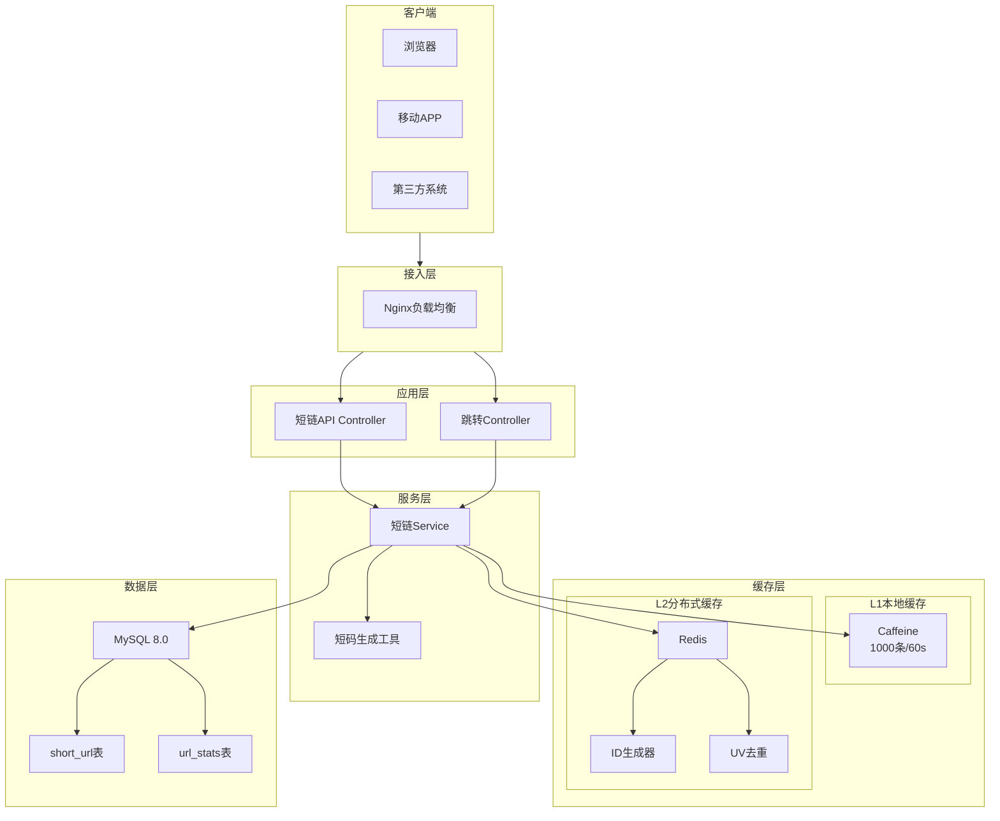
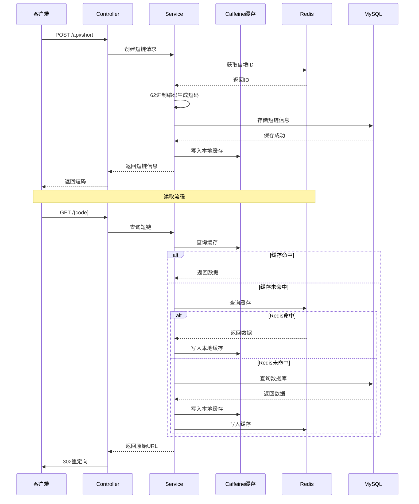
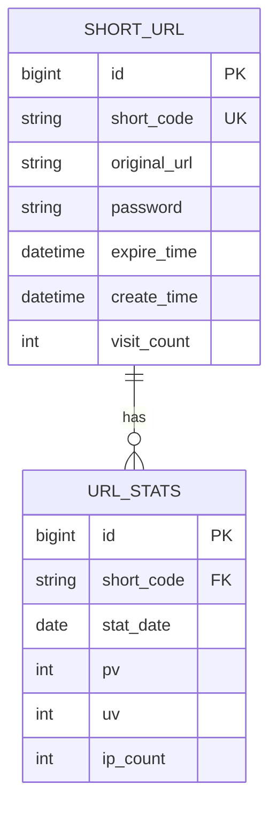
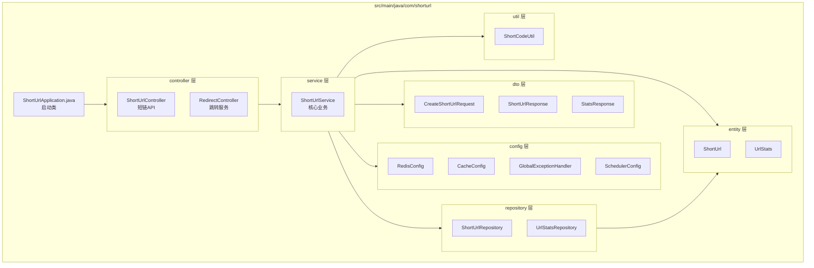
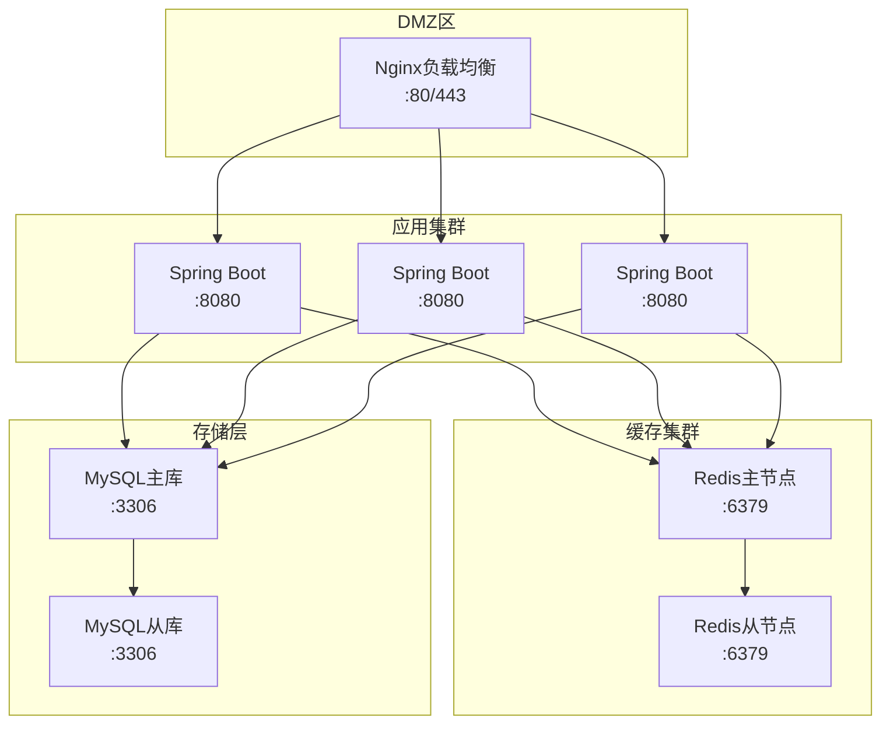

# 短链服务架构图

## 1. 系统架构图

```mermaid
graph TB
    subgraph Client ["客户端"]
        Browser[浏览器]
        Mobile[移动APP]
        ThirdParty[第三方系统]
    end

    subgraph Gateway ["接入层"]
        Nginx[Nginx负载均衡]
    end

    subgraph Application ["应用层"]
        ShortUrlController[短链API Controller]
        RedirectController[跳转Controller]
    end

    subgraph Service ["服务层"]
        ShortUrlService[短链Service]
        ShortCodeUtil[短码生成工具]
    end

    subgraph Cache ["缓存层"]
        subgraph L1 ["L1本地缓存"]
            Caffeine[Caffeine<br/>1000条/60s]
        end
        subgraph L2 ["L2分布式缓存"]
            Redis[Redis]
            IDGenerator[ID生成器]
            UVCounter[UV去重]
        end
    end

    subgraph Data ["数据层"]
        MySQL[MySQL 8.0]
        ShortUrlTable[short_url表]
        UrlStatsTable[url_stats表]
    end

    Client --> Gateway
    Gateway --> ShortUrlController
    Gateway --> RedirectController
    ShortUrlController --> ShortUrlService
    RedirectController --> ShortUrlService
    ShortUrlService --> Caffeine
    ShortUrlService --> Redis
    ShortUrlService --> MySQL
    ShortUrlService --> ShortCodeUtil
    Redis --> IDGenerator
    Redis --> UVCounter
    MySQL --> ShortUrlTable
    MySQL --> UrlStatsTable
```

## 2. 请求流程图

```mermaid
sequenceDiagram
    participant Client as 客户端
    participant Controller as Controller
    participant Service as Service
    participant Caffeine as Caffeine缓存
    participant Redis as Redis
    participant MySQL as MySQL

    Client->>Controller: POST /api/short
    Controller->>Service: 创建短链请求
    Service->>Redis: 获取自增ID
    Redis-->>Service: 返回ID
    Service->>Service: 62进制编码生成短码
    Service->>MySQL: 存储短链信息
    MySQL-->>Service: 保存成功
    Service->>Caffeine: 写入本地缓存
    Service-->>Controller: 返回短链信息
    Controller-->>Client: 返回短码

    Note over Client,Redis: 读取流程
    Client->>Controller: GET /{code}
    Controller->>Service: 查询短链
    Service->>Caffeine: 查询缓存
    alt 缓存命中
        Caffeine-->>Service: 返回数据
    else 缓存未命中
        Service->>Redis: 查询缓存
        alt Redis命中
            Redis-->>Service: 返回数据
            Service->>Caffeine: 写入本地缓存
        else Redis未命中
            Service->>MySQL: 查询数据库
            MySQL-->>Service: 返回数据
            Service->>Caffeine: 写入本地缓存
            Service->>Redis: 写入缓存
        end
    end
    Service-->>Controller: 返回原始URL
    Controller->>Client: 302重定向
```

## 3. 数据模型图

```mermaid
erDiagram
    SHORT_URL {
        bigint id PK
        string short_code UK
        string original_url
        string password
        datetime expire_time
        datetime create_time
        int visit_count
    }

    URL_STATS {
        bigint id PK
        string short_code FK
        date stat_date
        int pv
        int uv
        int ip_count
    }

    SHORT_URL ||--o{ URL_STATS : "has"
```

## 4. 模块依赖图

```mermaid
graph TD
    subgraph main ["src/main/java/com/shorturl"]
        app[ShortUrlApplication.java<br/>启动类]

        subgraph controller ["controller 层"]
            shortCtrl[ShortUrlController<br/>短链API]
            redirectCtrl[RedirectController<br/>跳转服务]
        end

        subgraph service ["service 层"]
            urlService[ShortUrlService<br/>核心业务]
        end

        subgraph repository ["repository 层"]
            urlRepo[ShortUrlRepository]
            statsRepo[UrlStatsRepository]
        end

        subgraph entity ["entity 层"]
            url[ShortUrl]
            stats[UrlStats]
        end

        subgraph dto ["dto 层"]
            createReq[CreateShortUrlRequest]
            resp[ShortUrlResponse]
            statsResp[StatsResponse]
        end

        subgraph config ["config 层"]
            redisCfg[RedisConfig]
            cacheCfg[CacheConfig]
            exHandler[GlobalExceptionHandler]
            schedCfg[SchedulerConfig]
        end

        subgraph util ["util 层"]
            codeUtil[ShortCodeUtil]
        end
    end

    app --> controller
    controller --> service
    service --> repository
    service --> entity
    service --> dto
    service --> config
    service --> util
    repository --> entity
```

## 5. 部署架构图

```mermaid
graph TB
    subgraph DMZ ["DMZ区"]
        LB[Nginx负载均衡<br/>:80/443]
    end

    subgraph AppCluster ["应用集群"]
        App1[Spring Boot<br/>:8080]
        App2[Spring Boot<br/>:8080]
        App3[Spring Boot<br/>:8080]
    end

    subgraph CacheCluster ["缓存集群"]
        Redis1[Redis主节点<br/>:6379]
        Redis2[Redis从节点<br/>:6379]
    end

    subgraph Storage ["存储层"]
        MySQL1[MySQL主库<br/>:3306]
        MySQL2[MySQL从库<br/>:3306]
    end

    LB --> App1
    LB --> App2
    LB --> App3
    App1 --> Redis1
    App2 --> Redis1
    App3 --> Redis1
    Redis1 --> Redis2
    App1 --> MySQL1
    App2 --> MySQL1
    App3 --> MySQL1
    MySQL1 --> MySQL2
```

---

*生成时间: 2026-04-05*